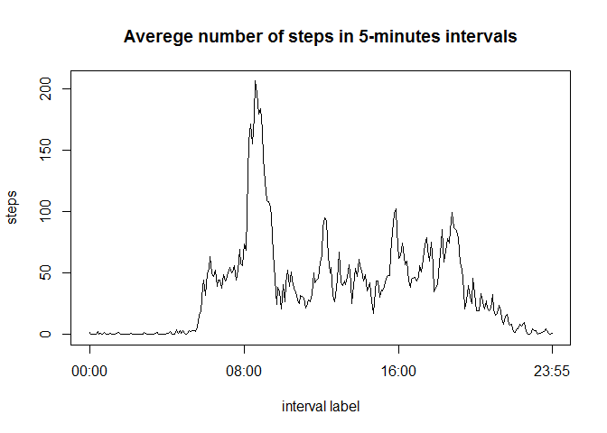
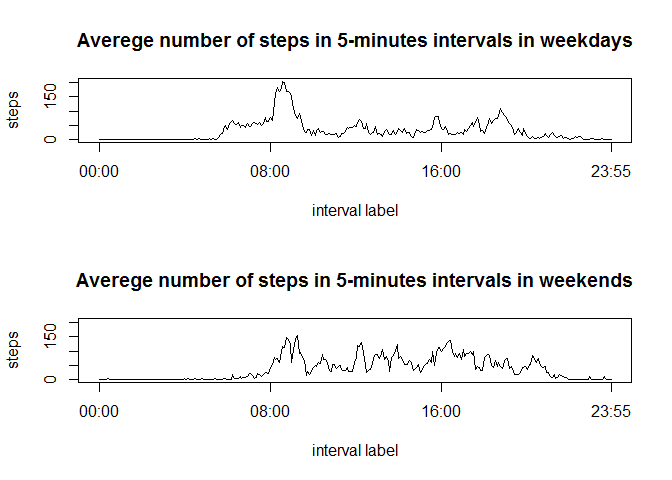

# Reproducible Research: Peer Assessment 1
Thsi is a document which reports a simple data analysis. It is in fact the first assessment of the Reproducible Research course coursera which is part of the Data Science Specialization offered by R. Peng, J. Leek and B. Caffo who are researchers in Department of Biostatistics at John Hopkins Bloomberg School of Public Health. 

## Loading and preprocessing the data
Let's unzip the data file firstly. The package 'utils' is needed to do so. Remember to set your working directory .


```r
library(utils)
unzip('activity.zip')
```
Let's now read the data into R. Let's set class of the column where date is as a character. It would be set as factor by default, and from my experience it is more convenient to transform character into factor than factor into anything. 

```r
data.raw<-read.csv('activity.csv',
                   colClasses=c('integer', 'character', 'integer')
                   )
```
Let's see how the loaded data looks like

```r
str(data.raw)
```

```
## 'data.frame':	17568 obs. of  3 variables:
##  $ steps   : int  NA NA NA NA NA NA NA NA NA NA ...
##  $ date    : chr  "2012-10-01" "2012-10-01" "2012-10-01" "2012-10-01" ...
##  $ interval: int  0 5 10 15 20 25 30 35 40 45 ...
```

```r
head(data.raw)
```

```
##   steps       date interval
## 1    NA 2012-10-01        0
## 2    NA 2012-10-01        5
## 3    NA 2012-10-01       10
## 4    NA 2012-10-01       15
## 5    NA 2012-10-01       20
## 6    NA 2012-10-01       25
```

```r
tail(data.raw)
```

```
##       steps       date interval
## 17563    NA 2012-11-30     2330
## 17564    NA 2012-11-30     2335
## 17565    NA 2012-11-30     2340
## 17566    NA 2012-11-30     2345
## 17567    NA 2012-11-30     2350
## 17568    NA 2012-11-30     2355
```
The interval variable looks wierd, let's transform it into character variable which would be more like an hour.

```r
into.char<-function(n){
      char<-as.character(n)
      char.split<-strsplit(char, split="")
      if (n<10) r<-paste('00:0', char,
                  sep='')
      if (n>=10 & n<100) r<-paste('00:', char,
                  sep='')
      if (n>=100 & n<1000) {
            r<-paste("0", 
                  char.split[[1]][1], 
                  ":",
                  char.split[[1]][2], 
                  char.split[[1]][3],
                  sep='')
      }
      if (n>=1000){
            r<-paste(char.split[[1]][1],
                  char.split[[1]][2], 
                  ":",
                  char.split[[1]][3], 
                  char.split[[1]][4],
                  sep='' )
      }
      r
}
data.raw$interval.char<-rep(" ", length(data.raw$interval))
for (i in 1:length(data.raw$interval)){
      data.raw$interval.char[i]<-into.char(data.raw$interval[i])
}
```


## What is mean total number of steps taken per day?
Let's calculate total number of steps taken per day.

```r
total.steps<-tapply(data.raw$steps, data.raw$date, sum, na.rm=TRUE)
```
And plot a histogram of the total number of steps taken per day. 

```r
hist(total.steps, col='red',
     main='Total number of steps taken per day', 
     xlab='number of steps')
```

 

Lets summarize the total number of steps taken per day a little bit. The mean is

```r
mean(total.steps)
```

```
## [1] 9354.23
```
and the median is

```r
median(total.steps)
```

```
## [1] 10395
```

## What is the average daily activity pattern?
Let's calculate averages of number of steps in 5-minute intervals across all days.

```r
intraday<-tapply(data.raw$steps, data.raw$interval.char, mean, na.rm=TRUE)
```
Let's see the daily pattern.

```r
plot(intraday, t='l',
     main='Averege number of steps in 5-minutes intervals',
     xlab='interval label',
     xaxt='n')
index<- data.raw$interval==0 | 
      data.raw$interval==800 | 
      data.raw$interval==1600 |  
      data.raw$interval==2355 
axis(1, at=(1:length(intraday))[index],
     labels=data.raw$interval.char[1:length(intraday)][index])
```

 

Let's see in which interval the average is the highest

```r
max(intraday)
```

```
## [1] 206.1698
```

```r
names(intraday[intraday==max(intraday)])
```

```
## [1] "08:35"
```
It turns out that during 8:35-8:40 interval tha average number of steps is the highest.

## Imputing missing values
Let's see how many missing values are in our data set.

```r
missings<-is.na(data.raw$steps)
sum(missings)
```

```
## [1] 2304
```
And what fraction of all data the missing values are.

```r
sum(missings)/length(data.raw$steps)
```

```
## [1] 0.1311475
```
Let's impute some values to these NAs. I combine two approaches. Firstly, calculate median for the values in the day where NA occurs. Secondly ,calculate median for the values in the interval in which NA occurs. Finally, take the mean of these 
The following function calculates the mean of the medians on the day and in the intervals for given row of the data.

```r
median.mean<-function(n){
      factor.day<-as.factor(data.raw$date)
      name.day<-as.character(data.raw$date[n])
      median.day<-median(split(data.raw, 
                               factor.day)[[name.day]]$steps, 
                         na.rm=TRUE)
      factor.interval<-as.factor(data.raw$interval)
      name.interval<-as.character(data.raw$interval[n])
      median.interval<-median(split(data.raw, 
                               factor.interval)[[name.interval]]$steps, 
                         na.rm=TRUE)
      mean(c(median.day,median.interval), na.rm=TRUE)
}
median.mean(10)
```

```
## [1] 0
```
Let's use the function to our NAs.

```r
data.no.nas<-data.raw
#where NAs are
index.nas<-(1:length(missings))[missings]

for (i in index.nas) data.no.nas$steps[i]<-median.mean(i)
```
Are all NAs replaced?

```r
sum(is.na(data.no.nas$steps))
```

```
## [1] 0
```
Let's calculate total number of steps taken per day.

```r
total.steps<-tapply(data.no.nas$steps, data.no.nas$date, sum, na.rm=TRUE)
```
And plot a histogram of the total number of steps taken per day. 

```r
hist(total.steps, col='red',
     main='Total number of steps taken per day', 
     xlab='number of steps')
```

 

Lets summarize the total number of steps taken per day a little bit. The mean is

```r
mean(total.steps)
```

```
## [1] 9503.869
```
and the median is

```r
median(total.steps)
```

```
## [1] 10395
```
Because of the construction we have chosen, the median has not changed. However the mean in higher a little bit in comparison to data with no imputation for NAs.

## Are there differences in activity patterns between weekdays and weekends?
Let's construct factor variable for the weekday weekend days distinction. We need package lubridate to ude wday function which in my opinion is mmore convenient than weekdays function.

```r
library(lubridate)
data<-data.no.nas
data$date<-as.Date(data$date)
factor.1<-wday(data$date)

#make sunday 8
factor.1[factor.1==1]<-8
factor.1<-cut(factor.1, c(0,6,8), labels=c('weekday','weekend'))

#add the weektime variable to the data
data$weektime<-factor.1
```

Let's calculate averages of number of steps in 5-minute intervals across all days on weekdays and weekends.

```r
data.split<-split(data,data$weektime)
intraday.weekdays<-tapply(data.split$weekday$steps, 
                          data.split$weekday$interval.char, 
                          mean)
intraday.weekends<-tapply(data.split$weekend$steps, 
                          data.split$weekend$interval.char, 
                          mean)
```
Let's see the daily pattern.

```r
par(mfrow=c(2,1))
plot(intraday.weekdays, t='l',
     main='Averege number of steps in 5-minutes intervals in weekdays',
     xlab='interval label',
     ylab='steps',
     xaxt='n')
index<- data$interval==0 | 
      data$interval==800 | 
      data$interval==1600 |  
      data$interval==2355 
axis(1, at=(1:length(intraday.weekdays))[index],
     labels=data$interval.char[1:length(intraday.weekdays)][index])

plot(intraday.weekends, t='l',
     main='Averege number of steps in 5-minutes intervals in weekends',
     xlab='interval label',
     ylab='steps',
     xaxt='n')
index<- data$interval==0 | 
      data$interval==800 | 
      data$interval==1600 |  
      data$interval==2355 
axis(1, at=(1:length(intraday.weekends))[index],
     labels=data$interval.char[1:length(intraday.weekends)][index])
```

 

It looks like people starts moving earlier in weekdays than in weekends. However, later during the day the average number of steps seems to be higher in weekends. 

